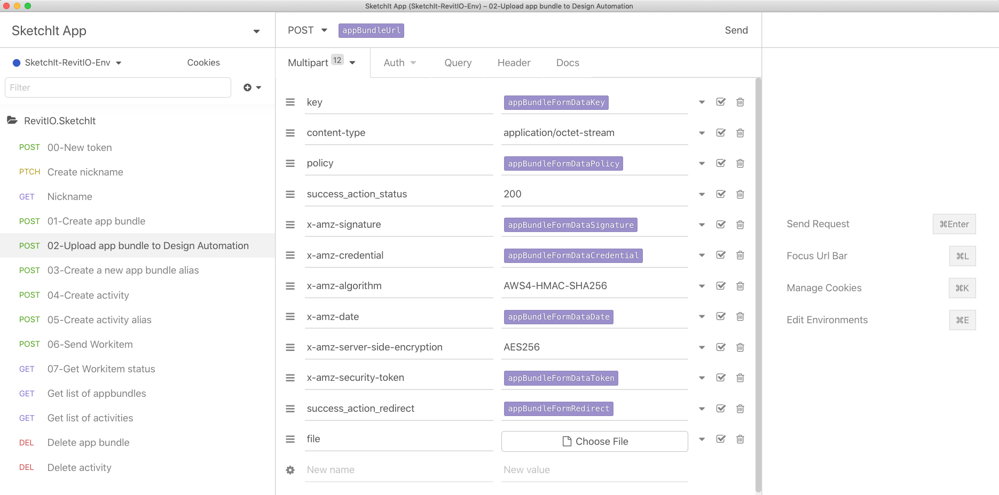

# Create App, Define Activity, Call the WorkItem

## Description
Insomnia.REST workflow to create App, define activity, and call the WorkItem. 

## Setup
`Before start with Design Automaiton workflow, I strongly recommend you to read throught all the details at` [Design Automation for Revit Documenation](https://forge.autodesk.com/en/docs/design-automation/v3),` and check the following steps if you already have basic understanding.`

1. Download or update Insomnia.REST from [here](https://insomnia.rest/download).

2. Create a Forge App. If you have already created a Forge App then you can skip this and proceed to the next step. 

3. From your local clone of the repository, import our `Insomnia data` [Sketchit-App_Insomnia](./SketchIt-App_Insomnia.json) into the Insomnia REST application.  You can find more details about it [here](https://support.insomnia.rest/article/52-importing-and-exporting-data)

 

4. After the import to Insomnia, we can see there is a predefined Enviorment called [SketchIt-RevitIO-Env](Sketchit-App_Insomnia-ENV.json) 
which will need your input for the variable values (client ID, client Secret...) This will make the process smoother and faster to use. You can find more details about it [here](https://support.insomnia.rest/article/18-environment-variables)

 

5. Select the environment and enter your [Forge App's](https://developer.autodesk.com/myapps) `Client ID` and `Client Secret`. This is used for authentication. In the environment variables give your app an easy to manage unique nickname.

6. Compile and package the sample applications as noted [here](https://forge.autodesk.com/en/docs/design-automation/v3/tutorials/revit/step4-publish-appbundle/). You will need this to upload the app to Design Automation. Alternatively you may also download the packages from [SketchIt.zip](../Revit.Addin/SketchItApp/bundles/SketchIt.zip).

7. Create a nickname for your Forge App.

8. Publish your Design Automation appbundle.

9. Publish your Design Automation activity.

10. Prepare your input and output url. 

11. Post your Design Automation workitem.

## Usage

These Insomnia samples will allow you to easily issue REST API calls without using cumbersome cURL commands.

Note that you will have to carefully read through the requests - `DELETE`-ing an `app` or `activity` will delete all its associated versions!

Note that for all `workitems` kindly provide signed URL for the expected output file. Else the `workitem` post will result with `failedUpload`.

REST API documentation on Design Automation V3 can be found [here](https://forge.autodesk.com/en/docs/design-automation/v3/reference/http/).

## Written by

Jaime Rosales D.  

[Forge Partner Development](http://forge.autodesk.com)